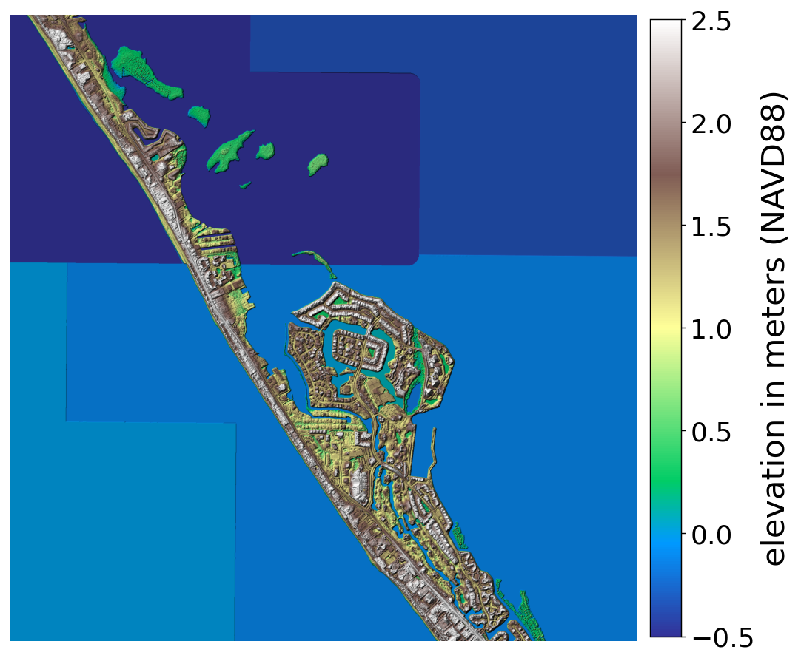
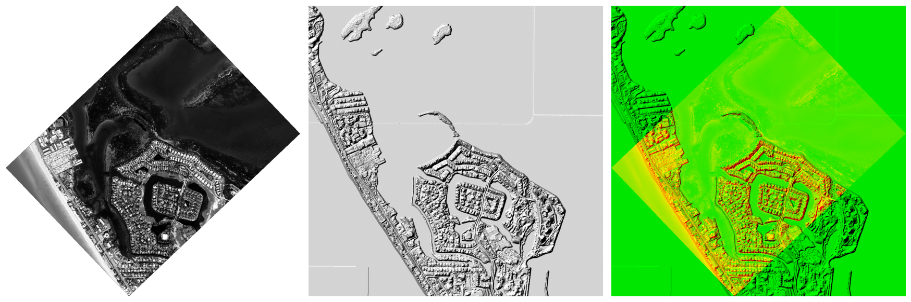

.. _aerial_bathymetry:

Aerial images for shallow-water bathymetry
------------------------------------------

This is an end-to-end example for how to to produce bathymetry-corrected
(:numref:`bathy_intro`) digital elevation models (DEM) with images from an
airborne frame-camera survey.

The images were crated with a Leica RCD30 camera flown over the Gulf coast near
Sarasota, Florida, at about 2300 m above the water, with a ground sample
distance of about 0.23 m. 

Vendor metadata
~~~~~~~~~~~~~~~

The data came with an an exterior-orientation table (extrinsics). Each line
has the image name the camera position in a projected coordinate system, and the
orientation as omega, phi, and kappa angles.

What follows is a simplified example of such a file. The column headers and
the values in the rows below must be one-to-one, with *tabs as separators*. The
order can be variable, as the fields are found by name. Some names can have
spaces, such as ``Image ID``. Other fields (such as standard deviation) are
ignored. The full vendor delivery, with many more columns, is read as-is.

Example::

    Filename     Image ID X        Y         Z      Omega  Phi    Kappa
    img_0003.tif 0        337557.0 3028849.6 2309.6 0.059  -0.071 -136.386

The interior orientation (intrinsics) are provided in an ESRI camera CSV format,
giving the focal length, pixel size, principal point, image dimensions, and lens
distortion::

    CameraModel,FocalLength,PrincipalX,PrincipalY,NRows,NCols,PixelSize,DistortionType,Radial,Tangential
    RCD30,53000,0,0,7788,10336,5.2,DistortionModel,0;0;0;0,0;0

Here the focal length and pixel size are in microns. 

The RCD30 delivers already-undistorted imagery (all distortion coefficients are
zero), as is typical for a metric aerial camera. In general, the OpenCV
radial-tangential lens distortion model will be assumed, with the coefficients
in the order K1, K2, K3, P1, P2 (:numref:`pinhole_distortion`).

Neither metadata file states its coordinate system or the frame the angles are
in. Those are set by the vendor's convention, which we set below with the the
``--vendor`` option. 

ASP supports parsing in addition the orientations given as roll, pitch, yaw
(:numref:`cam_gen_extrinsics`). 

It is suggested to study such input on a case-by-case basis. Our Pinhole camera
format used for output is described in :numref:`pinholemodels`.

Creation of camera models
~~~~~~~~~~~~~~~~~~~~~~~~~

The following creates one ASP Pinhole camera per image::

    cam_gen --vendor esri                  \
      --extrinsics RCD30_2026_eop.txt      \
      --intrinsics RCD30_2026_cam_esri.csv \
      --image-list images.txt              \
      --output-dir cameras                 \
      --t_srs EPSG:32617

Here ``images.txt`` lists the input images (one per line). Each is matched to an
exterior-orientation record by its file name. The program writes one ``.tsai``
camera per image into the directory ``cameras``, and saves the list of those
cameras, in *the same order* as ``images.txt``, to ``cameras/camera_list.txt``. That
list is passed later to ``bundle_adjust`` (:numref:`bundle_adjust`) and
``parallel_stereo`` (:numref:`parallel_stereo`).

The value of ``--t_srs`` is the projected coordinate system of the positions in the
exterior-orientation file, given as a PROJ, WKT, or EPSG string (here UTM zone 17N
on the WGS84 datum). It cannot be inferred from the easting and northing alone, so
it must be provided. Only the ESRI convention is supported at this time. 

For the ESRI convention the omega, phi, and kappa angles are referenced to the
projected grid, so the grid axes are not aligned with true north away from the
central meridian. ``cam_gen`` accounts for this grid-to-true-north convergence
automatically, computing it from the coordinate system at each camera. 

Getting this wrong produces a constant rotation of every camera about its
optical axis, which is easy to miss in a summary statistic but is caught
immediately by the validation below.

.. _aerial_bathymetry_refdem:

A reference terrain
~~~~~~~~~~~~~~~~~~~

Validation and bundle adjustment both need a prior terrain over the area. A free
global option is the Copernicus 30 m DEM. Its heights are relative to the EGM2008
geoid, so they must be converted to WGS84 ellipsoid heights with ``dem_geoid``
(:numref:`dem_geoid`) before use, as discussed in :numref:`initial_terrain`. 

Where available, the USGS 3DEP lidar DEM is a much finer alternative (about 1
m), also convertible with ``dem_geoid`` (its heights are relative to the NAVD88
geoid).

   The USGS 3DEP lidar DEM over the site, as a terrain-colored hillshade. The
   barrier island, circular canal development, and bay islands are resolved. Blue
   is low (water and bay), green to tan to white is rising land. Water is flat
   fill, so the bay shows tile-boundary blocks.

.. _aerial_bathymetry_validate:

Validating the input cameras
~~~~~~~~~~~~~~~~~~~~~~~~~~~~

Before bundle adjustment, confirm that the cameras place the imagery correctly
on the ground. Mapproject a frame onto the reference DEM with its created camera
(:numref:`mapproject`)::

    mapproject                             \
      --t_srs EPSG:32617                   \
      ref_dem.tif                          \
      20251113_155312_032_003.tif          \
      cameras/20251113_155312_032_003.tsai \
      frame_map.tif

Then overlay the mapprojected frame on the DEM's hillshade, for example in
``stereo_gui`` (:numref:`stereo_gui`). If the cameras are right, the landmarks
will agree. 

   Left: a frame mapprojected with its ``cam_gen`` camera. Center: the 3DEP lidar
   DEM hillshade over the same area. Right: the two overlaid. 

This check is strongly suggested. Vendors differ in their angle and coordinate
conventions, and a wrong convention can result in gross misalignment. 

.. _aerial_bathymetry_ba:

Bundle adjustment
~~~~~~~~~~~~~~~~~

The vendor positions are usually excellent, but a small constant orientation offset
can remain. Bundle adjustment (:numref:`bundle_adjust`) refines the cameras so they
are mutually consistent::

    bundle_adjust                            \
      --image-list  images.txt               \
      --camera-list cameras.txt              \
      --inline-adjustments                   \
      --auto-overlap-params 'ref_dem.tif 15' \
      --min-triangulation-angle 1e-10        \
      --forced-triangulation-distance 2000   \
      --camera-position-uncertainty 100,100  \
      --num-iterations 100 --num-passes 2    \
      -o ba/run

The option ``--auto-overlap-params`` uses the prior DEM to decide which images
overlap, rather than trying all pairs (:numref:`ba_options`). An airborne block has
many low-convergence neighbors (adjacent frames along a strip look nearly straight
down), so ``--min-triangulation-angle`` is set very small to keep those pairs, and
``--forced-triangulation-distance`` (roughly the camera height above the ground, in
meters) provides a stable range where the rays are nearly parallel. The value of
``--camera-position-uncertainty`` (here 100 m in the horizontal and vertical) is a
soft anchor to the vendor positions. Keep it lenient. Too tight a constraint can
prevent convergence.

Inspect the result. The initial and final reprojection error statistics are printed
to the screen and saved to the ``pointmap.csv`` files (:numref:`ba_err_per_point`).
Also inspect how far the cameras moved. For this block, bundle adjustment moved the
camera positions by only about 0.2 m (the vendor positions were already good), and
the reprojection error dropped from about 100 pixels, driven by a small constant
optical-axis rotation, to about 0.3 pixels, confirming that the block is now
internally consistent.

From here the adjusted cameras (in ``ba/run-*.tsai``) are used directly for
``parallel_stereo`` and the shallow-water bathymetry processing of
:numref:`bathy_intro`.
